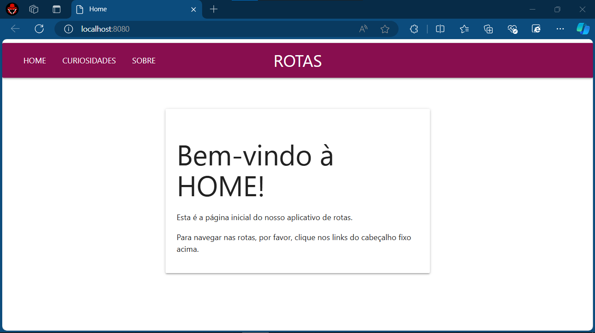
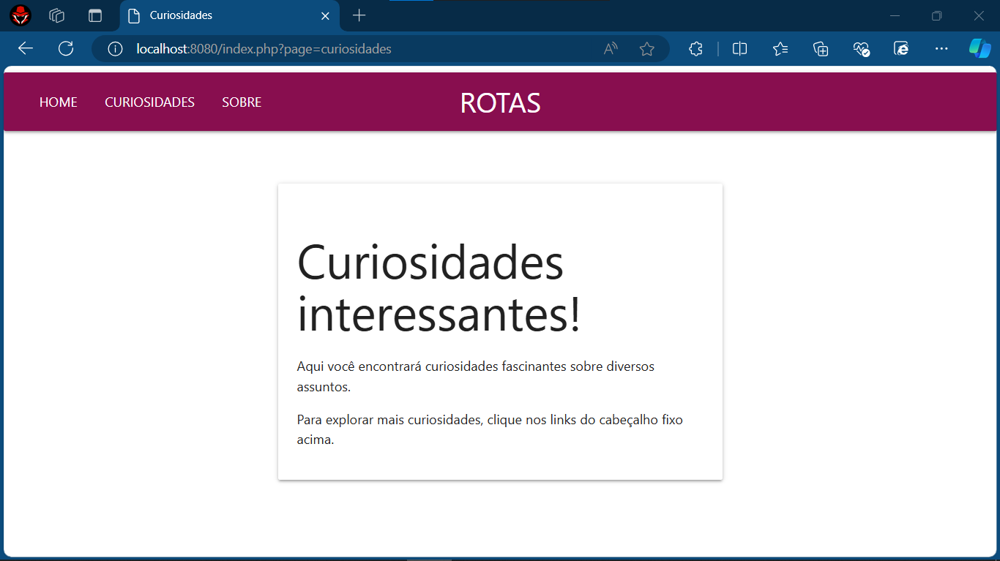
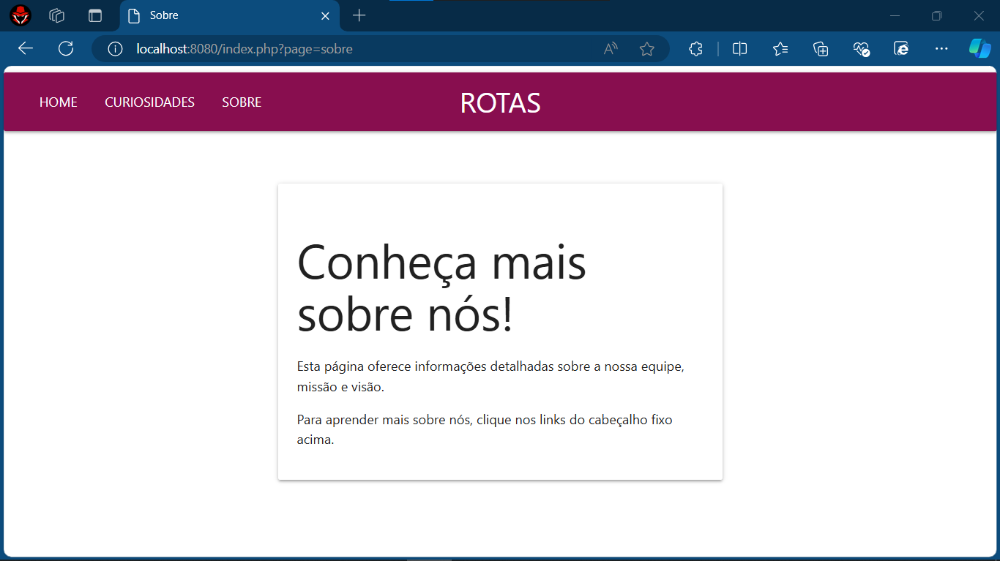

# ROTAS COM PHP
👨‍💻APLICAÇÃO DE ROTAS APENAS COM A LINGUAGEM, SEM FRAMEWORKS!

 <br> 
 <br>
 <br> 

## DESCRIÇÃO:
- Este aplicativo web simples implementado em PHP, utilizando MaterializeCSS para o frontend, serve como uma interface para navegar em diferentes rotas.

- Este aplicativo web é uma demonstração simples de como implementar roteamento de páginas em PHP, utilizando MaterializeCSS para estilização, e oferece uma maneira fácil e intuitiva de explorar diferentes seções do aplicativo através de um cabeçalho fixo.

## RECURSOS:
1. **Roteamento de Páginas**: O aplicativo possui três páginas principais acessíveis através do cabeçalho fixo: HOME, CURIOSIDADES e SOBRE. Cada uma dessas páginas corresponde a uma rota específica.

2. **Página HOME**: A página inicial apresenta uma breve mensagem de boas-vindas e instruções sobre como navegar nas rotas usando os links no cabeçalho fixo.

3. **Página CURIOSIDADES**: A página de curiosidades exibe informações interessantes sobre vários assuntos. Assim como na página HOME, também fornece instruções para navegar nas rotas.

4. **Página SOBRE**: A página "Sobre" oferece detalhes sobre a equipe por trás do aplicativo, sua missão e visão.

5. **Cabeçalho Fixo Personalizado**: O cabeçalho fixo na parte superior da página apresenta o nome "ROTAS" centralizado, fornecendo uma navegação consistente entre as diferentes páginas.

## EXECUTANDO O PROJETO:
1. **Executando o Aplicativo com Apache**  
   - Coloque os arquivos em um servidor web compatível com PHP, como XAMPP, WAMP ou LAMP.
   - Acesse o formulário no navegador visitando [http://localhost/CODIGO/index.php](http://localhost/CODIGO/index.php).

2. **Executando o Aplicativo com `php.exe`**  
   - Como alternativa, você pode iniciar o servidor diretamente no diretório `./CODIGO` utilizando o seguinte comando:

   ```bash
   php -S localhost:8080
   ```

   - Em seguida, acesse o formulário no navegador através do endereço: [http://localhost:8080](http://localhost:8080).

## NÃO SABE?
- Entendemos que para manipular arquivos em `PHP`, `CSS` e outras linguagens relacionadas, é necessário possuir conhecimento nessas áreas. Para auxiliar nesse aprendizado, oferecemos cursos gratuitos disponíveis:
* [CURSO DE HTML E CSS](https://github.com/VILHALVA/CURSO-DE-HTML-E-CSS)
* [CURSO DE PHP](https://github.com/VILHALVA/CURSO-DE-PHP)
* [CURSO DE MATERIALIZECSS](https://github.com/VILHALVA/CURSO-DE-MATERIALIZECSS)
* [CONFIRA MAIS CURSOS](https://github.com/VILHALVA?tab=repositories&q=+topic:CURSO)

## CREDITOS E SUBSIDIOS:
- [PROJETO CRIADO PELO VILHALVA](https://github.com/VILHALVA)
- [VEJA MAIS PROJETOS DE ROTAS](https://github.com/VILHALVA?tab=repositories&q=+topic%3ASITE+ROTAS+COM&type=&language=&sort=)


